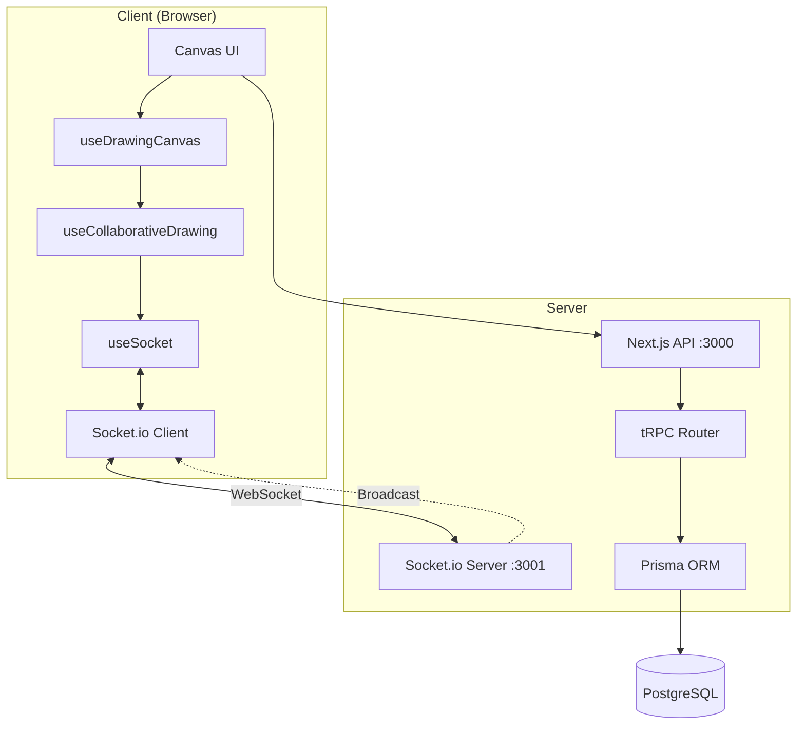
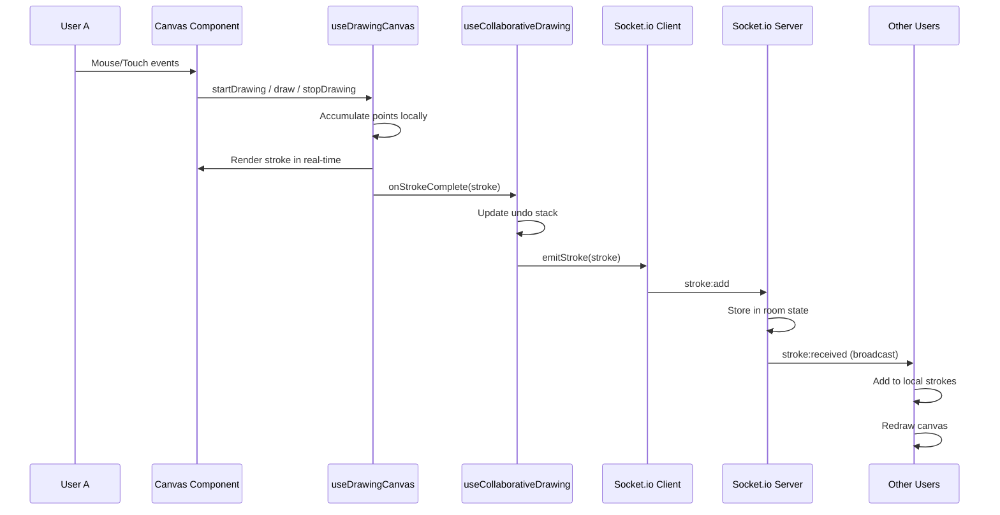
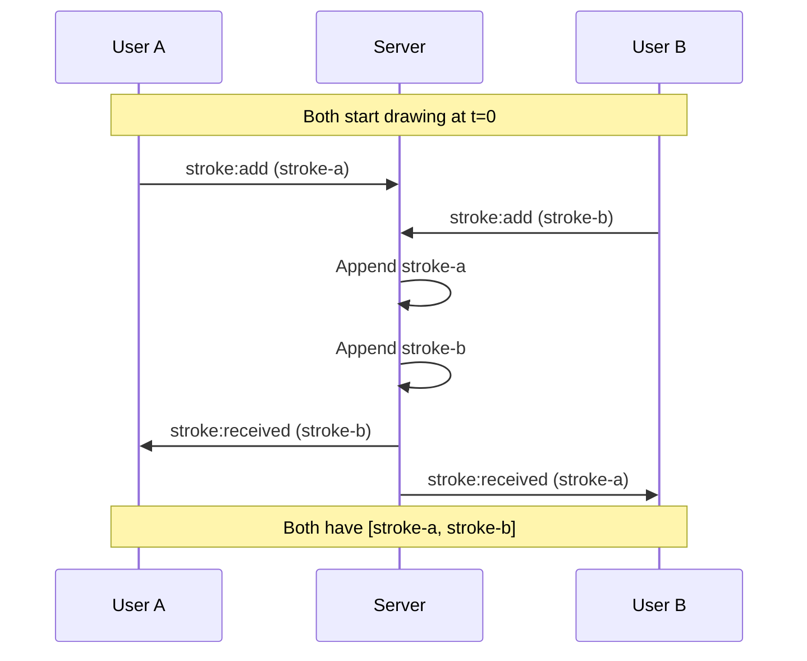
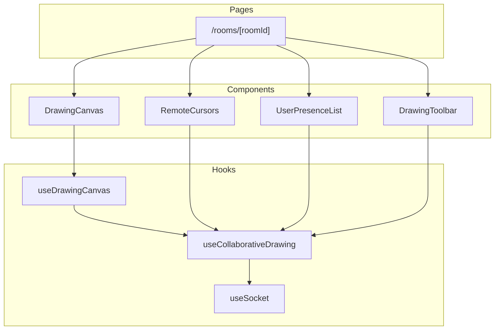

# Architecture Documentation 🏗️

This document describes the technical architecture of the Collaborative Drawing Canvas application.

---

## 📊 Data Flow Diagram



### Drawing Event Flow



---

## 🔌 WebSocket Protocol

### Event Types

The application uses typed events defined in `socket.events.ts`:

```typescript
export const SOCKET_EVENTS = {
  // Connection
  CONNECT: 'connect',
  DISCONNECT: 'disconnect',
  CONNECT_ERROR: 'connect_error',

  // Room Management
  JOIN_ROOM: 'room:join',
  LEAVE_ROOM: 'room:leave',
  ROOM_JOINED: 'room:joined',
  ROOM_DELETED: 'room:deleted',
  ROOM_ERROR: 'room:error',

  // Drawing
  STROKE_ADD: 'stroke:add',
  STROKE_RECEIVED: 'stroke:received',
  CANVAS_CLEAR: 'canvas:clear',
  CANVAS_CLEARED: 'canvas:cleared',
  CANVAS_UNDO: 'canvas:undo',
  CANVAS_REDO: 'canvas:redo',
  CANVAS_STATE: 'canvas:state',

  // Cursor
  CURSOR_MOVE: 'cursor:move',
  CURSOR_UPDATE: 'cursor:update',

  // Presence
  USER_JOIN: 'user:join',
  USER_LEAVE: 'user:leave',
  USERS_LIST: 'users:list',
}
```

### Message Payloads

| Event | Direction | Payload |
|-------|-----------|---------|
| `room:join` | Client → Server | `{ roomId, userId, userName, userColor }` |
| `room:joined` | Server → Client | `{ users: User[], strokes: DrawingStroke[] }` |
| `stroke:add` | Client → Server | `{ roomId, stroke: DrawingStroke }` |
| `stroke:received` | Server → Clients | `DrawingStroke` |
| `canvas:undo` | Client → Server | `{ roomId, strokes: DrawingStroke[] }` |
| `canvas:state` | Server → Clients | `{ strokes: DrawingStroke[] }` |
| `cursor:move` | Client → Server | `{ roomId, userId, position: Point \| null }` |
| `cursor:update` | Server → Clients | `{ userId, position: Point \| null }` |
| `user:join` | Server → Clients | `User` |
| `user:leave` | Server → Clients | `{ userId }` |

### Data Types

```typescript
interface DrawingStroke {
  id: string;
  points: Point[];
  color: string;
  width: number;
  tool: 'brush' | 'eraser';
  userId: string;
  timestamp: number;
}

interface Point {
  x: number;
  y: number;
}

interface User {
  id: string;
  name: string;
  color: string;
  cursor: Point | null;
  isOnline: boolean;
}
```

---

## 🔄 Undo/Redo Strategy

### Architecture

```mermaid
flowchart LR
    subgraph LocalState["Local State (per user)"]
        US[Undo Stack: DrawingStroke[][]]
        RS[Redo Stack: DrawingStroke[][]]
    end
    
    subgraph ServerState["Server State (per room)"]
        SS[Current Strokes: DrawingStroke[]]
    end
    
    US -->|"Pop & emit"| SS
    SS -->|"Push previous"| RS
    RS -->|"Pop & emit"| SS
    SS -->|"Push previous"| US
```

### How It Works

1. **Local Stack Management**
   - Each user maintains their own `undoStack` and `redoStack` locally
   - Stacks store complete canvas state snapshots (array of all strokes)

2. **Undo Operation**
   ```typescript
   const undo = useCallback(() => {
     setLocalState(prev => {
       if (prev.undoStack.length === 0) return prev;
       
       const previousStrokes = prev.undoStack.pop();
       emitUndo(previousStrokes);  // Send to server
       
       return {
         undoStack: [...prev.undoStack],
         redoStack: [...prev.redoStack, currentStrokes],
       };
     });
   }, [emitUndo]);
   ```

3. **Server Broadcast**
   - Server receives `canvas:undo` with the new state
   - Broadcasts `canvas:state` to ALL users (including sender)
   - All clients update to the same state

### Trade-offs

| Approach | Pros | Cons |
|----------|------|------|
| **Full state snapshot** (current) | Simple, always consistent | Memory grows with history |
| Operation-based | Memory efficient | Complex conflict resolution |
| Server-authoritative history | Persistent across refreshes | Server complexity, latency |

---

## ⚡ Performance Decisions

### 1. Canvas Rendering

**Device Pixel Ratio (DPR) Scaling**
```typescript
const dpr = window.devicePixelRatio || 1;
canvas.width = rect.width * dpr;
canvas.height = rect.height * dpr;
ctx.scale(dpr, dpr);
```
- **Why**: Crisp lines on high-DPI displays (Retina, 4K)
- **Trade-off**: 4x more pixels to render on 2x DPR displays

**Immediate Local Rendering**
```typescript
const draw = useCallback((e) => {
  // Draw locally immediately
  ctx.lineTo(point.x, point.y);
  ctx.stroke();
  // Points accumulated, sent on mouseup
}, []);
```
- **Why**: Zero latency for the drawing user
- **Trade-off**: Brief inconsistency until server confirms

### 2. Socket.io Configuration

```typescript
socket = io(socketUrl, {
  transports: ['websocket', 'polling'],  // WebSocket preferred
  reconnection: true,
  reconnectionAttempts: 5,
  reconnectionDelay: 1000,
  reconnectionDelayMax: 5000,
});
```

| Setting | Value | Rationale |
|---------|-------|-----------|
| `transports` | `['websocket', 'polling']` | WebSocket for speed, polling as fallback |
| `reconnectionAttempts` | 5 | Balance reliability vs. giving up |
| `reconnectionDelayMax` | 5000ms | Prevent thundering herd |

### 3. State Management

**Stroke Batching**
- Points are accumulated during drawing
- Only complete strokes are emitted on `mouseup`
- Reduces message count by ~10-50x compared to per-point

**Ref-based State Access**
```typescript
const strokesRef = useRef(strokes);
useEffect(() => { strokesRef.current = strokes; }, [strokes]);
```
- **Why**: Avoid stale closures in callbacks
- **Why not useState**: Would cause re-renders during drawing

### 4. Memory Considerations

| Component | Growth Pattern | Mitigation |
|-----------|---------------|------------|
| Strokes array | Linear with drawing | None (limitation) |
| Undo stack | Linear with actions | None (limitation) |
| User list | Bounded by room size | Auto-cleanup on leave |
| Cursor updates | Constant (replaced) | N/A |

---

## 🤝 Conflict Resolution

### Last-Write-Wins (Current Implementation)



### Why This Works for Drawing

1. **Additive Operations**: Drawing strokes are additive - they don't conflict
2. **Order Doesn't Matter**: Visual result is the same regardless of order
3. **No Overwriting**: Each stroke has a unique ID

### Conflict Scenarios & Handling

| Scenario | Behavior | User Experience |
|----------|----------|-----------------|
| **Simultaneous drawing** | Both strokes added | ✅ Expected |
| **Draw + Clear race** | Clear wins, stroke lost | ⚠️ Acceptable |
| **Undo + Draw race** | Last event wins | ⚠️ Can cause confusion |
| **Network partition** | Strokes queue, sync on reconnect | ⚠️ May cause jumps |

### Potential Improvements

1. **Server Timestamps**: Order by server time, not client time
2. **Vector Clocks**: For true causal ordering
3. **OT/CRDT**: For character-level merge (overkill for strokes)

---

## 🏛️ Component Architecture



---

## 🔐 Security Considerations

| Layer | Protection |
|-------|------------|
| **Authentication** | NextAuth with session tokens |
| **Room Access** | Passcode hashed with bcrypt |
| **API Routes** | tRPC protected procedures |
| **WebSocket** | Room membership validated |

---

## 📈 Scaling Considerations

### Current Limits (Single Server)

- ~100 concurrent users per room (memory bound)
- ~10,000 strokes before performance degrades
- ~50 rooms per server instance

### Scaling Path

1. **Horizontal**: Redis adapter for Socket.io pub/sub
2. **Persistence**: Store strokes in PostgreSQL
3. **CDN**: Static assets on edge
4. **Sharding**: Room-based server assignment
